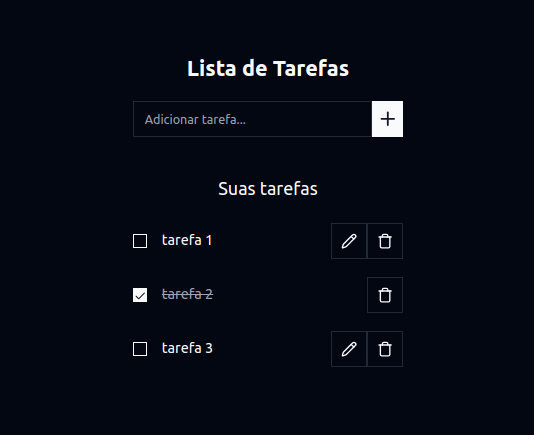

# Todo List

## 🔥 Introdução

Resolução de um dos Code Challenge da ProUnion

### ⚙️ Pré-requisitos

```
node
git
```

### 🔨 Guia de instalação e execução

Etapas para instalar e executar:

Clone o repositório:

```
git clone https://github.com/Darlan0307/Test-ProUnion-1.git
```

Entre na pasta do projeto:

```
cd Test-ProUnion-1/
```

Entre na pasta backend, instale as dependências e inicie o servidor:

```
cd backend/
npm install
npm run dev
```

Crie outro terminal e entre na pasta fronend e instale as dependências e inicie a aplicação:

```
cd frontend/
npm install
npm run dev
```

A aplicação estará disponível em [localhost:5173](http://localhost:5173/)

## 📦 Tecnologias usadas:

**Front-end:**


**Back-end:**


## 👷 Autor

- **Darlan Martins** - _Desenvolvedor_
